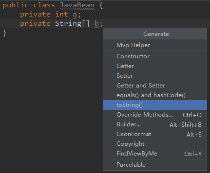
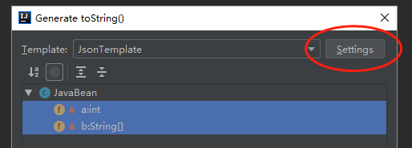
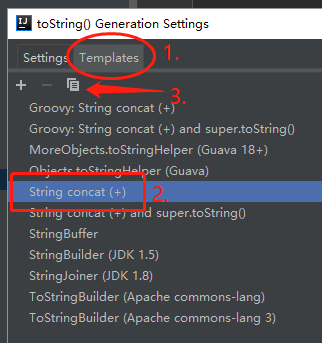
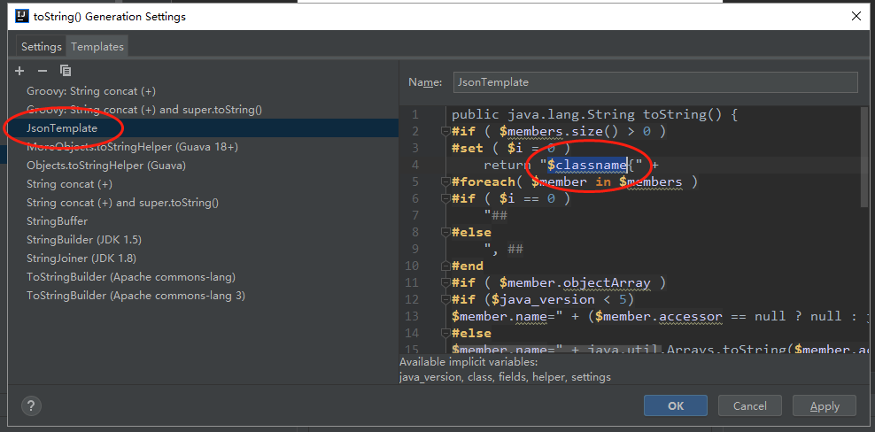
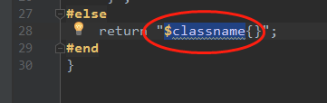
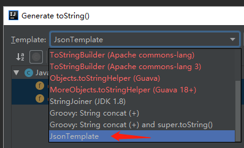

# Idea 和 Andriod Studio 设置 toString() 的 Json 模版

### 1. `Alt + Insert` 选择 `toString()` , 或从菜单栏的 `Code` --> `Generate` 打开进入

### 2.选中 `Templates` , 从系统默认的 `String concat(+)` 复制一个, 然后随意命名新模版(我命名为 `JsonTemplate` )

### 3.选中自己复制命名的新模版, 在右侧编辑框删掉所有的 `$classname` , 一般是有2个

### 4.完成. 如果没效果的话, 检查一下在生成 toString 的时候是不是选中了新模版

